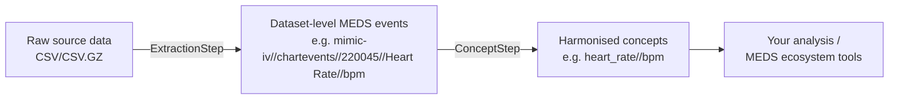

# OpenICU

[](https://github.com/aidh-ms/OpenICU/actions/workflows/continuous_integration.yml)
[](https://coveralls.io/github/aidh-ms/OpenICU?branch=main)
[](https://github.com/aidh-ms/OpenICU/blob/main/pyproject.toml)
[](LICENSE)

**OpenICU** is an open-source Python framework for extracting and harmonising intensive care unit (ICU) data from heterogeneous sources — such as [MIMIC-IV](https://physionet.org/content/mimiciv/), [eICU-CRD](https://physionet.org/content/eicu-crd/), and your own institutional database exports — into the standardised [MEDS](https://github.com/Medical-Event-Data-Standard/meds) (Medical Event Data Standard) format.

Instead of writing one-off SQL or pandas scripts for every dataset and every study, you describe *what* to extract in declarative YAML configurations and let OpenICU handle the *how*: typed reading, joins, timestamp reconstruction, unit-aware event codes, and cross-dataset concept harmonisation. OpenICU ships with curated configurations for public ICU datasets and a growing dictionary of clinical concepts (vital signs, laboratory values, vasopressors, ventilation, and more), so the same study code can run against any supported dataset.

OpenICU is the spiritual successor to dataset-harmonisation tools like [`ricu`](https://github.com/eth-mds/ricu) (R), rebuilt in Python on a modern stack: [Polars](https://pola.rs) for fast, out-of-core streaming processing, [Pydantic](https://docs.pydantic.dev) for validated configuration, and MEDS for an interoperable output format that plugs directly into the wider MEDS ecosystem of modelling and evaluation tools.

---

**Source code:** <https://github.com/aidh-ms/OpenICU> · **Issues:** <https://github.com/aidh-ms/OpenICU/issues>

---

## Why OpenICU?

- **One concept, many datasets.** Define a clinical concept (e.g. *heart rate*, *norepinephrine rate*, *antibiotics*) once; map it per dataset with small YAML files. Extraction code stays identical across MIMIC-IV, eICU-CRD, NWICU, and custom sources.
- **MEDS-native output.** All output is written as MEDS-compliant Parquet (`subject_id`, `time`, `code`, `numeric_value`, `text_value`, plus configurable extension columns) with full metadata (`dataset.json`, `codes.parquet`) — ready for MEDS-compatible downstream tooling.
- **Declarative, versioned, reproducible.** Every table, event, and concept is a versioned YAML config with a stable identifier. The exact merged configuration used for a run is snapshotted into the output project, so results can be traced and reproduced.
- **Versions and variants as diffs.** New dataset versions and variants (like the eICU demo) `extend` a reference version and state only their differences — no copied configs to keep in sync. The entire eICU demo configuration is two small files.
- **Fully offline.** Designed for sensitive medical data: no network access required, nothing leaves your secure perimeter.
- **Scales down and up.** Polars lazy streaming lets you process full MIMIC-IV on a 16–32 GB laptop, without a database server or cluster.
- **Extensible.** Add new datasets by writing YAML (no Python required); add new transformation callbacks or complex concept logic in Python where YAML isn't enough.

## How it works

OpenICU organises processing as a pipeline of **steps** that operate inside a **project** directory:



1. **Extraction step** — reads the raw tables of each dataset (typed CSV scan, lookup-table joins, timestamp reconstruction) and emits one MEDS event stream per configured event. Event codes preserve full provenance: `dataset//table//itemid//label//unit`.
2. **Concept step** — maps dataset-specific event codes onto shared, dataset-agnostic clinical concepts using pattern matching (*simple* concepts), computation over other concepts (*derived* concepts), or custom Python transformers (*complex* concepts). Concept dependencies are resolved automatically.
3. **Sharding step** *(in development)* — re-partitions harmonised data into analysis-ready shards.

Each step reads its inputs and writes its outputs as a self-contained MEDS dataset inside the project, so intermediate results are inspectable and individual steps can be re-run in isolation.

## Supported datasets

OpenICU ships with ready-to-use extraction and concept configurations under [`config/`](config/):

| Dataset | Version | Extraction configs | Concept mappings |
| --- | --- | --- | --- |
| [MIMIC-IV](https://physionet.org/content/mimiciv/3.1/) | 3.1, 2.2 | 19 tables (ICU + hosp) | ~80 concepts |
| [MIMIC-IV demo](https://physionet.org/content/mimic-iv-demo/2.2/) | 2.2 | inherited from MIMIC-IV via `extends` | inherited |
| [eICU-CRD](https://physionet.org/content/eicu-crd/2.0/) | 2.0 | 14 tables | in progress |
| [eICU-CRD demo](https://physionet.org/content/eicu-crd-demo/2.0/) | 2.0 | inherited from eICU-CRD via `extends` | inherited |
| [NWICU](https://physionet.org/content/nwicu/0.1.0/) | 0.1.0 | 9 tables | in progress |

The shared concept dictionary in [`config/concept/`](config/concept/) currently covers ~90 concepts across vital signs, blood gas, clinical chemistry, hematology, medications (incl. vasopressors and antibiotics), neurological scores, respiratory parameters, fluid output, and demographics.

> [!NOTE]
> Access to the public datasets themselves requires the usual credentialing on [PhysioNet](https://physionet.org/). OpenICU works on the downloaded CSV/CSV.GZ files — no database setup needed.

## Installation

OpenICU requires **Python 3.13+**. Until the first PyPI release, install from GitHub:

```bash
# with pip
pip install git+https://github.com/aidh-ms/OpenICU

# with uv
uv add git+https://github.com/aidh-ms/OpenICU
```

For development, clone the repository and use the included dev container or [`uv`](https://docs.astral.sh/uv/):

```bash
git clone https://github.com/aidh-ms/OpenICU.git
cd OpenICU
uv sync --all-groups
```

## Quickstart

A pipeline is two small YAML files plus a few lines of Python.

**1. Configure the extraction step** (`config/extraction.yml`) — point OpenICU at the bundled dataset configs and your local data:

```yaml
name: Extraction
version: 1.0.0

config_files:
  - path: /path/to/OpenICU/config/dataset/mimic-iv/3.1/dataset/

config:
  data:
    - name: mimic-iv
      path: /path/to/physionet.org/files/mimiciv/3.1
```

**2. Configure the concept step** (`config/concept.yml`) — select the concept dictionary and per-dataset mappings:

```yaml
name: Concept
version: 1.0.0

config_files:
  - path: /path/to/OpenICU/config/concept

config:
  extraction_step: Extraction
  dataset_configs:
    - name: mimic-iv
      path: /path/to/OpenICU/config/dataset/mimic-iv/3.1/concept/
```

**3. Run the pipeline:**

```python
from pathlib import Path

from open_icu import OpenICUProject, ExtractionStep, ConceptStep

config_path = Path.cwd() / "config"
project_path = Path.cwd() / "output" / "project"

with OpenICUProject(project_path) as project:
    extraction_step = ExtractionStep.load(project, config_path / "extraction.yml")
    extraction_step.run()

    concept_step = ConceptStep.load(project, config_path / "concept.yml")
    concept_step.run()
```

**4. Use the results.** The project directory now contains one MEDS dataset per step:

```
output/project/
├── configs/        # snapshot of every config used (reproducibility)
├── workspace/      # intermediate per-step files
└── datasets/
    ├── extraction/
    │   ├── data/mimic-iv/3.1/<table>/<EVENT>.parquet
    │   └── metadata/{dataset.json, codes.parquet}
    └── concept/
        ├── data/<concept>/<version>/<dataset>.parquet
        └── metadata/{dataset.json, codes.parquet}
```

Read it with any Parquet-capable tool, e.g.:

```python
import polars as pl

heart_rate = pl.scan_parquet(
    project_path / "datasets" / "concept" / "data" / "heart_rate" / "1.0.0" / "mimic-iv.parquet"
).collect()
```

A complete runnable example lives in [`example/pipeline.ipynb`](example/pipeline.ipynb).

## Configuration at a glance

OpenICU is configured at three levels — see the [documentation](#documentation) for the full reference.

**Dataset/table configs** (`config/dataset/<dataset>/<version>/dataset/*.yml`) describe how to turn one raw table into MEDS events: typed columns, joins, and event definitions.

```yaml
path: icu/chartevents.csv.gz

columns:
  - name: subject_id
    type: int64
  - name: charttime
    type: datetime
    params: { format: "%Y-%m-%d %H:%M:%S" }
  - name: itemid
    type: int64
  - name: value
    type: string
  - name: valuenum
    type: float32
  - name: valueuom
    type: string

join:
  - path: icu/d_items.csv.gz
    both_on: [itemid]
    columns: [{ name: itemid, type: int64 }, { name: label, type: string }]

events:
  - name: CHART
    columns:
      subject_id: col(subject_id)
      time: col(charttime)
      code: [col(itemid), col(label), col(valueuom)]
      numeric_value: col(valuenum)
      text_value: col(value)
```

`name` is a technical event identifier used by the extraction step. It is not included in the generated MEDS `code`; the code is built from the automatic dataset/table prefix, optional `code_prefix`, configured `columns.code` components, and optional `code_suffix`.

**Concept configs** (`config/concept/<category>/*.yml`) define dataset-agnostic clinical concepts:

```yaml
name: heart_rate
version: 1.0.0
unit: bpm
```

**Concept mappings** (`config/dataset/<dataset>/<version>/concept/*.yml`) connect a concept to dataset-specific codes:

```yaml
type: simple
mappings:
  - pattern:
      table: chartevents
      event: CHART  # technical extraction event identifier, not part of `code`
      code: (220045//Heart Rate)
    columns:
      numeric_value: col(numeric_value)
```

Here, `event` selects the technical extraction event stream; it is not matched as part of the MEDS `code`.

Wherever values are computed, configs use a small **expression language** with composable callbacks — e.g. reconstructing absolute timestamps from eICU's relative offsets:

```yaml
callbacks:
  - to_datetime(hospitaldischargeyear, 1, 1, hospitaladmittime24, hospitaladmitoffset, "minutes", output=admission_timestamp)
post_join_callbacks:
  - add_offset(admission_timestamp, labresultoffset, output=event_timestamp)
```

Arithmetic, comparisons, and boolean logic work as ordinary expressions (`col(weight) / (col(height) * col(height))`), and custom callbacks can be registered from Python.

## Documentation

- [Package overview](docs/getting_started/overview.md)
- [Installation](docs/getting_started/installation.md)
- [Basic usage](docs/getting_started/basic_usage.md)
- User guide: [pipeline & projects](docs/user_guide/pipeline.md) · [extraction configs](docs/user_guide/extraction.md) · [dataset versions & variants](docs/user_guide/versioning.md) · [concept configs](docs/user_guide/concepts.md) · [expression language](docs/user_guide/expressions.md)
- [Contributing](docs/getting_started/contributing.md)
- Architecture documentation following [arc42](https://docs.arc42.org/home/) in [`docs/arc/`](docs/arc/)

## Project status & roadmap

OpenICU is in active development (pre-1.0); configuration formats may still change between minor versions. Current focus areas:

- Completing concept mappings for eICU-CRD and NWICU
- The sharding step for analysis-ready data partitioning
- Additional datasets (e.g. MIMIC-IV demo, HiRID, AmsterdamUMCdb)
- A first PyPI release

Contributions of dataset configurations and concept definitions are especially welcome — they are pure YAML and require no changes to the framework itself.

## Contributing

We welcome contributions! Please use the dev container for a ready-to-go environment, follow [Conventional Commits](https://www.conventionalcommits.org/) (`feat:`, `fix:`, `docs:`, …), and make sure checks pass before opening a PR:

```bash
uv run ruff format && uv run ruff check    # format & lint
uv run ty check .                          # type checking
uv run pytest                              # tests
```

See the [contributing guide](docs/getting_started/contributing.md) for details, and our [Code of Conduct](.github/CODE_OF_CONDUCT.md).

## Citation

If you use OpenICU in your research, please cite it via the metadata in [`CITATION.cff`](CITATION.cff) (use the *"Cite this repository"* button on GitHub).

## Related projects

- [MEDS](https://github.com/Medical-Event-Data-Standard/meds) — the Medical Event Data Standard that OpenICU targets
- [`ricu`](https://github.com/eth-mds/ricu) — R package for ICU data harmonisation that inspired OpenICU's concept dictionary
- [YAIB](https://github.com/rvandewater/YAIB) — Yet Another ICU Benchmark, a complementary benchmarking framework

## License

OpenICU is released under the [MIT License](LICENSE).
Developed by the [AIDH MS](https://github.com/aidh-ms) team at the University of Münster and the Medical University of Innsbruck.
